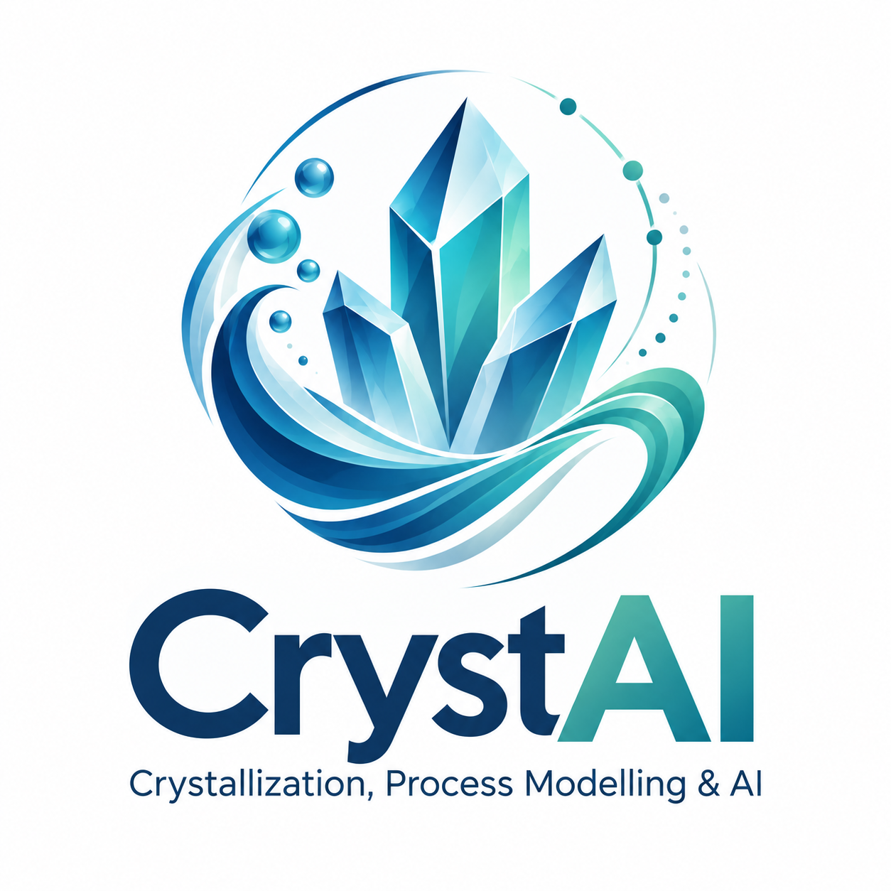

# Antonello Raponi, PhD

**Mines Saint-Étienne · Centre SPIN – Département PEG**  
**Laboratoire Georges Friedel, UMR 5307 CNRS**

Mechanistic modelling · Population balances · CFD · Deep learning · Inverse design

---

## About

I am an Associate Professor (*Maître de conférences*) at **Mines Saint-Étienne**, working on the modelling, design and optimization of crystallization, precipitation and multiphase reactive processes.

**CrystAI** is the research identity I use for work at the interface of **crystallization science, process modelling and artificial intelligence**. The objective is to develop predictive and transferable models that combine physical interpretability with data-driven acceleration.

My research currently focuses on four closely connected areas:

- **Crystallization & precipitation** — nucleation, crystal growth, aggregation, dissolution and particle-size distributions.
- **CFD–PBM modelling** — coupling fluid dynamics, reaction engineering and population balance models across reactor scales.
- **AI & inverse design** — deep-learning mirror models, surrogate modelling and kinetic-parameter identification.
- **CO₂ capture & mineralization** — reactive crystallization and carbonation processes linking carbon capture with valuable solid products.

---

## Selected research software

### 🧠 AI & inverse design

**[Inverse-Design](https://github.com/araponi/Inverse-Design)**  
Deep-learning inverse design for magnesium hydroxide precipitation, combining mechanistic CFD–PBM simulations with a neural-network mirror model for kinetic-parameter identification and particle-property control.

**[Deep-Learning---Mirror-model](https://github.com/araponi/Deep-Learning---Mirror-model)**  
Foundational implementation of the mirror-model concept for identifying precipitation kinetics from experimentally accessible particle descriptors.

### 🌊 CFD & population balances

**[CFD-PBM](https://github.com/araponi/CFD-PBM)**  
Three-dimensional CFD–PBM framework for multivariate optimization and inverse design of multiphase reactive systems using deep learning.

**[Mg-OH-2-precipitation---1D-model](https://github.com/araponi/Mg-OH-2-precipitation---1D-model)**  
Predictive one-dimensional population-balance model for Mg(OH)₂ precipitation in static mixers, with CFD-informed hydrodynamics and QMOM-based particle modelling.

### ⚗️ Reactive systems

**[Neutralization-reaction-modelling](https://github.com/araponi/Neutralization-reaction-modelling)**  
Three-dimensional solver for dilution and neutralization reactions in T-mixers, developed for coupled mixing and reactive-flow studies.

---

## Current CrystAI directions

Current work extends these approaches toward:

- **CO₂-driven lithium carbonate reactive crystallization**;
- **gas–liquid–solid population-balance modelling**;
- **deep-learning inverse identification of crystallization kinetics**;
- **CO₂ mineralization and magnesium recovery**;
- **physics-based synthetic data generation for inverse process design**.

Several of these repositories are maintained privately while the associated manuscripts are under development and will be released with the corresponding publications.

---

## Modelling philosophy

The central idea behind CrystAI is simple:

> **Use mechanistic models to encode the physics, and machine learning to make difficult inverse and design problems tractable.**

Rather than replacing first-principles models, our data-driven tools are designed to work *with* them — accelerating parameter identification, design-space exploration and process optimization while preserving physical meaning.

---

## Methods & tools

`Population Balance Models` · `CFD` · `OpenFOAM` · `Python` · `MATLAB` · `Deep Learning` · `Inverse Design` · `Crystallization` · `Reactive Multiphase Flows`

---

## Contact

**Antonello Raponi, PhD**  
Associate Professor / Maître de conférences  
Mines Saint-Étienne · Institut Mines-Télécom  
Laboratoire Georges Friedel, UMR 5307 CNRS  
Centre SPIN – Département PEG  

📧 antonello.raponi@emse.fr

---

### CrystAI
**Crystallization, Process Modelling & AI**

*Physics-based modelling · Data-driven acceleration · Inverse process design*

